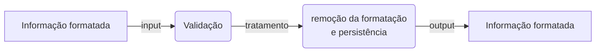

# brasilidades

## 1. Etapas que a informação passa



## 2. Expressões regulares (regex)

Permitem encontrar **padrões bem definidos** em textos.

Testes: [regex101](https://regex101.com/)

|Operador|Propósito|
|:-:|-|
| ^ | início da linha |
| $ | fim da linha |
| [ ] | definem um intervalo ou conjunto de caracteres. Ex: `[a-z]`, `[0-9]` ou `[abc]` |
| x{n} | n caracteres x |
| x{m,n} | no mínimo m e no máximo n caracteres x |
| \\d | qualquer número de 0-9 |
| \\w | qualquer número de 0-9, letra de A-Z ou _underline_ |
| \\ | precede um caracter especial. Ex: `\.`, `\-`, `\/`, `\@` |
| x* | caracter x pode ocorrer "infinitas" vezes ou nenhuma |
| `a|b` | caracter `a` ou `b` |
| () | captura o grupo |

### Exemplos

#### CEP

```regex
/^[0-9]{2}\.[0-9]{3}\-[0-9]{3}$/
```

- exemplo: `12.345-678`
  - `/^`: início da linha
  - `[0-9]{2}`: duas ocorrências de um número no intervalo passado (`12`)
  - `\.`: o caracter especial "ponto" que separa `12` e `345`
  - `[0-9]{3}`: ocorrências de um número no intervalo passado (`345`)
  - `\-`: o caracter especial "traço" que separa `345` e `678`
  - `[0-9]{3}`: ocorrências de um número no intervalo passado (`345`)
  - `/$`: fim de linha

#### Email

```regex
/^[a-z0-9.]+@[a-z0-9]+.[a-z]+.([a-z]+)?$/
```

## 3. Validando CPF

Os últimos dois números de um CPF (`x` e `y`, no exemplo que segue) são chamados de _digitos verificadores_ e podem ser obtidos a partir dos outros números através de alguns cálculos. A seguir são apresentados os passos para obter os digitos verificadores do número de CPF `123.456.789-xy`:

1. Primeiro digito verificador (x)
  
- preenchemos a tabela abaixo colocando os números do CPF na ordem na primeira linha e na segunda os pesos de cada número:

    | CPF<sub>i</sub> | 1 | 2 | 3 | 4 | 5 | 6 | 7 | 8 | 9 |
    |-|:-:|:-:|:-:|:-:|:-:|:-:|:-:|:-:|:-:|
    | Peso<sub>i</sub> | 10 | 9 | 8 | 7 | 6 | 5 | 4 | 3 | 2 |
    | CPF<sub>i</sub> x Peso<sub>i</sub> | 10 | 18 | 24 | 28 | 30 | 30 | 28 | 24 | 18 |

  - Após multiplicar cada um dos números no CPF pelo seu peso, somamos todos estes números:

$$\sum_{i=1}^{9} CPF_i * Peso_i = 10 + 18 + 24 + 28 + 30 + 30 + 28 + 24 + 18 = 210 = resultadoSoma_1$$

$$resultadoSoma_1 = 210$$

- o resto da divisão deste total (resultadoSoma<sub>1</sub>) por **11** deve ser subtraído de **11**:
  - 210 % **11** = 1
  - **11** - 1 = 10

    > _"Se o resultado da subtração for maior que 9, o dígito é **ZERO**. Caso contrário, o dígito verificador é o **resultado** dessa subtração."_

- Portanto, o primeiro digito verificador do CPF apresentado acima é `0`.

2. obtendo o segundo digito verificador (y)

- repetimos o processo anterior, mas agora adicionando o digito verificador na tabela e modificando os pesos:

| CPF<sub>i</sub> | 1 | 2 | 3 | 4 | 5 | 6 | 7 | 8 | 9 | 0 |
|-|:-:|:-:|:-:|:-:|:-:|:-:|:-:|:-:|:-:|:-:|
| Peso<sub>i</sub> | 11 | 10 | 9 | 8 | 7 | 6 | 5 | 4 | 3 | 2 |
| CPF<sub>i</sub> x Peso<sub>i</sub> | 11 | 20 | 27 | 32 | 35 | 36 | 35 | 32 | 27 | 0 |

$$resultadoSoma_2 = \sum_{i=1}^{10} CPF_i * Peso_i = 255$$

  - 255 % **11** = 2  
  - **11** - 2 = 9

> _"Se o resultado da subtração for maior que 9, o dígito é **ZERO**. Caso contrário, o dígito verificador é o **resultado** dessa subtração."_

- Portanto, o segundo digito verificador do CPF apresentado acima é `9`.

## 4. Validando CNPJ

O CNPJ também possui regras específicas de validação para obter os digitos verificadores, a diferença para o CPF fica pela quantidade de caracteres e os pesos. Tomando o número `12.345.678/9123-xy` como exemplo:

1. obtendo o primeiro digito verificador (x)

| _i_ | 1 | 2 | 3 | 4 | 5 | 6 | 7 | 8 | 9 | 10 | 11 | 12 |
|-|:-:|:-:|:-:|:-:|:-:|:-:|:-:|:-:|:-:|:-:|:-:|:-:|
| CNPJ<sub>i</sub> | 1 | 2 | 3 | 4 | 5 | 6 | 7 | 8 | 9 | 1 | 2 | 3 |
| Peso<sub>i</sub> | 5 | 4 | 3 | 2 | 9 | 8 | 7 | 6 | 5 | 4 | 3 | 2 |
| CNPJ<sub>i</sub> x Peso<sub>i</sub> | 5 | 8 | 9 | 8 | 45 | 48 | 49 | 48 | 45 | 4 | 6 | 6 |

$$total_1 = \sum_{i=1}^{9} CPF_i * Peso_i = 5 + 8 + 9 + 8 + 45 + 48 + 49 + 48 + 40 + 4 + 6 + 6 = 281 = total_1$$

$$total_1 = 281$$

- 281 % **11** = 6
- **11** - 6 = 5

> _"Se o resto da divisão total<sub>i</sub> for menor que 2, o dígito é **ZERO**. Caso contrário, o dígito verificador é o **resultado** da subtração do resto de **11**._"

Como o resto de divisão do total por **11** é 1, o primeiro digito verificador do nosso exemplo é `5`.

2. obtendo o segundo digito verificador (y)

| _i_ | 1 | 2 | 3 | 4 | 5 | 6 | 7 | 8 | 9 | 10 | 11 | 12 | 13 |
|-|:-:|:-:|:-:|:-:|:-:|:-:|:-:|:-:|:-:|:-:|:-:|:-:|:-:|
| CNPJ<sub>i</sub> | 1 | 2 | 3 | 4 | 5 | 6 | 7 | 8 | 9 | 1 | 2 | 3 | 5 |
| Peso<sub>i</sub> | 6 | 5 | 4 | 3 | 2 | 9 | 8 | 7 | 6 | 5 | 4 | 3 | 2 |
| CNPJ<sub>i</sub> x Peso<sub>i</sub> | 6 | 10 | 12 | 12 | 10 | 54 | 56 | 56 | 54 | 5 | 8 | 9 | 10 |

- total<sub>2</sub> = 302
  - 302 % **11** = 6
  - **11** - 5 = 6

- Como o resto da divisão de total<sub>2</sub> por **11** é maior que 1, o segundo digito verificador do CNPJ é `6`.
